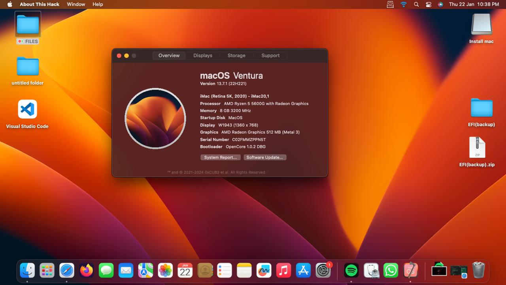

# Hackintosh-Ryzen5-5600G-iGpu-AsrockB450

Hackintosh OpenCore EFI for Ryzen 5 5600G(iGPU) + ASRockb450M - MacOS Ventura Optimized

---

## 📸 Preview

  

---

## 🔧 BIOS Settings (Important)

Recommended BIOS configuration:

- **CSM:** Disabled  
- **Secure Boot:** Disabled  
- **Above 4G Decoding:** Enabled  
- **SATA Mode:** AHCI  
- **Fast Boot:** Disabled  
- **XHCI Hand-off:** Enabled  
- **Primary Graphics Adapter:** iGPU  

---

## 🚀 Installation Steps

1. Create macOS installer bootlable USB using **Olarilia(recommended) macOS Vanilla images or any other installer**
2. Mount EFI partition on USB
3. Replace EFI with this repository’s EFI folder or download from [here](https://github.com/Vishal9485/Hackintosh-Ryzen5-5600G-iGpu-AsrockB450/releases/tag/v1)
4. Edit `config.plist`:
   - Update **SMBIOS**
   - Generate new **Serial / MLB / UUID**
5. Boot from USB → Install macOS
6. After installation, copy EFI to system drive

---

## 🛠️ Tools Used

- OpenCore
- ProperTree
- GenSMBIOS
- NootedRed(by ChefKissInc)
- Olarilia vanilla images

---

## ⚠️ Disclaimer

- This EFI is made **for educational purposes only**
- macOS is property of Apple Inc.
- Use at your own risk
- Hardware compatibility may vary

---

## 🤝 Credits

- OpenCore Team
- Dortania OpenCore Install Guide
- AMD Hackintosh community

---

## ⭐ Support

If this EFI helped you:
- Star ⭐ the repo
- Share improvements via pull request
- Open an issue for bugs or suggestions

Happy Hackintoshing 🍎